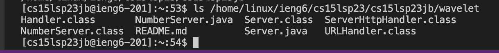
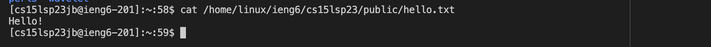
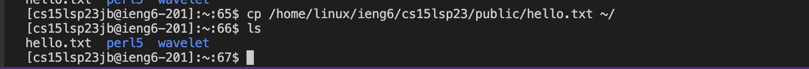

# Introduction to connecting remotely into your course-specific account!
---
To do so, follow the 3 basic steps down below:

## Step 1: Install Visual Studio Code

If you haven't installed VSCode to your computer, do the following:

1. Click the [Link](https://code.visualstudio.com/download) and follow the steps according to your computer system.
2. After doing so, your Visual Studio Code should look something like this:

## Step 2: Connect Remotely:

1. Now that you have VSCode, go ahead and open a new terminal, if you're using MacOS it should look like the following picture:

2. Select the option bash from your terminal like in the picture:

3. In your terminal type the command `ssh cs15lsp23zz@ieng6.ucsd.edu` where the zz is replaced by the letters in your own username.
4. It will ask you for permission, so make sure to type `yes` and hit enter.
5. After saying yes, it will ask you for your password, **Note that you will not see any characters when typing your password, DO NOT WORRY,** type it as usual and finish your log in, it should look like the following picture:

6. THAT'S IT! You now have remote access to your account on ieng6.

## Step 3: Make sure it's running well:

Now that you have remote access, you want to make sure that you are connected correctly, to do that, run the following commands:
* pwd: returns full path name of your working directory.
* cd: changes current working directory.
* ls -lat: returns contents of the current directory. One per line, starting with "." and in chronological order starting from newest.
* ls -a: returns contents of the current directory starting with ".".
* ls <directory>: where <directory> is replaced by /home/linux/ieng6/cs15lsp23/cs15lsp23abc and "abc" is your username.
* cd ~: changes current working directory to previous.
* cat /home/linux/ieng6/cs15lsp23/public/hello.txt
* cp /home/linux/ieng6/cs15lsp23/public/hello.txt ~/
**Note that the commands might look something like this:**
  pwd

* cd

  
* ls -lat

  
* ls -a

  
* ls <directory>

  
* cd ~

  
* cat

  
* cp

---
If you followed the steps accordingly, you should now have remote access to your ieng6 account!

